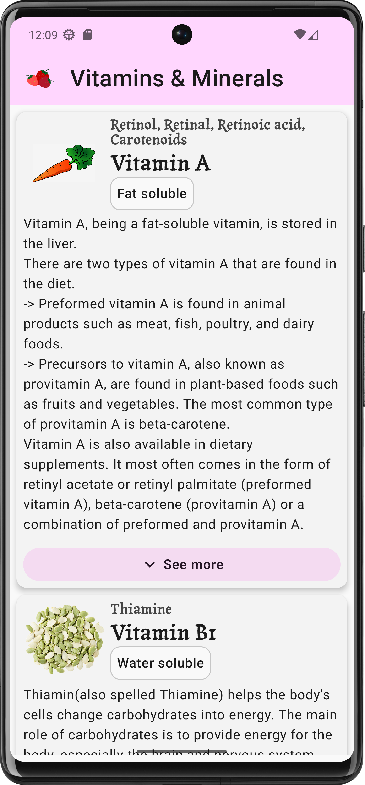

# Vitamins & Minerals Cheatsheet

Vitamins and Minerals is a simple yet useful, aesthetic design and beautiful app for
learning more about vitamins and minerals and having these information always in-hand on
your phone.

It is also a project for practicing everything covered in units 1, 2, and 3 of [Android Basics with Compose](https://developer.android.com/courses/android-basics-compose/course) course.

## About the app

The app is  displaying information about vitamins and minerals in an interactive and fun way. The app's UI follows [Material Design](https://m3.material.io/styles/) guidelines for
accessibility, adaptive layout, theming, and typography.

There are many common attributes that both vitamins and minerals have in common, such as
name, description, and health benefits.
But, there exist some other attributes specific to only vitamins or minerals, like the solubility
,which minerals do not have.
Since both vitamins and minerals are Micronutrients, the same hierarchy
is established in the code through class inheritance.

## Screenshots:

**Portrait mode (Light theme):**

**Portrait mode (Dark theme):**

**Landscape mode/tablets:**

## Important files:

[MainActivity.kt](app/src/main/java/com/safire/vitaminsmineralscheatsheet/MainActivity.kt): Contains
the entry code of the app, main screen preview, and app bar preview composeables.

### The UI package

[VitaminsMineralsScreen.kt](app/src/main/java/com/safire/vitaminsmineralscheatsheet/ui/VitaminsMineralsScreen.kt): Contains
every UI element visible in the app

### The model package

[DataSource.kt](app/src/main/java/com/safire/vitaminsmineralscheatsheet/model/DataSource.kt): Contains a
list of Micronutrient Items (Vitamins and Minerals), and it's the main data source of the app.

[MicronutrientItem.kt](app/src/main/java/com/safire/vitaminsmineralscheatsheet/model/MicronutrientItem.kt): Represents
a Micronutrient item in form of an open class

[VitaminItem.kt](app/src/main/java/com/safire/vitaminsmineralscheatsheet/model/VitaminItem.kt): Data
class for vitamin item, which inherits the Micronutrient class

[MineralItem.kt](app/src/main/java/com/safire/vitaminsmineralscheatsheet/model/MineralItem.kt): Data
class for mineral item, which inherits the Micronutrient class

[Solubility.kt](app/src/main/java/com/safire/vitaminsmineralscheatsheet/model/Solubility.kt): An enum
for the solubility of vitamins

## Installation

There are two ways to install the app.

- Downloading and running [this](Vitamins%20&%20Minerals.apk) apk file on your phone (fast and easy) -
  Recommended for exploring and testing the app.
- Importing the project in Android Studio and running on your device (needs familiarity with
  Android Studio) - Recommended for exploring the
  code, learning, debugging, or making changes to it.

Note: At the moment, the app can be installed on Android phones only.

## Credits

### Medical Information:

- MedlinePlus ➡  [Medical Encyclopedia](https://medlineplus.gov/encyclopedia.html), [Vitamins](https://medlineplus.gov/ency/article/002399.htm)
- The Better Health chanel ➡ [Vitamins and minerals](https://www.betterhealth.vic.gov.au/health/healthyliving/Vitamins-and-minerals)
- Healthdirect Australia ➡ [Vitamins and minerals explained](https://www.healthdirect.gov.au/vitamins-and-minerals-explained)

### UX Testing

- UX testing performed by me and [Chinaza Blossom](https://github.com/Chinazablossom)

### Typography

- [Tagesschrift Regular, Google fonts](https://fonts.google.com/specimen/Tagesschrift)

### Drawables (images, illustrations, icons):

- Strawberry (App icon) ➡
  Image by <a href="https://pixabay.com/users/marcuesbo-2280516/?utm_source=link-attribution&utm_medium=referral&utm_campaign=image&utm_content=3339247">Marta Cuesta</a> from <a href="https://pixabay.com//?utm_source=link-attribution&utm_medium=referral&utm_campaign=image&utm_content=3339247">Pixabay</a>
- Carrot illustration (Vitamin A) ➡ Image by <a href="https://pixabay.com/users/felixmh-3374205/?utm_source=link-attribution&utm_medium=referral&utm_campaign=image&utm_content=2985399">Felix Mendoza</a> from <a href="https://pixabay.com//?utm_source=link-attribution&utm_medium=referral&utm_campaign=image&utm_content=2985399">Pixabay</a>
- Seeds (Vitamin B1)(AI generated) ➡ Image by <a href="https://pixabay.com/users/imagemo-44158621/?utm_source=link-attribution&utm_medium=referral&utm_campaign=image&utm_content=8864310">IMAGEMO DESIGN STUDIO</a> from <a href="https://pixabay.com//?utm_source=link-attribution&utm_medium=referral&utm_campaign=image&utm_content=8864310">Pixabay</a>
- Dairy products food (Vitamin B2) ➡ Image by <a href="https://pixabay.com/users/artsybeekids-392631/?utm_source=link-attribution&utm_medium=referral&utm_campaign=image&utm_content=5621769">Venita Oberholster</a> from <a href="https://pixabay.com//?utm_source=link-attribution&utm_medium=referral&utm_campaign=image&utm_content=5621769">Pixabay</a>
- Mushrooms (Vitamin B3) ➡ Image by <a href="https://pixabay.com/users/khyrul2010-7108945/?utm_source=link-attribution&utm_medium=referral&utm_campaign=image&utm_content=9589737">Khyrul Islam Milon</a> from <a href="https://pixabay.com//?utm_source=link-attribution&utm_medium=referral&utm_campaign=image&utm_content=9589737">Pixabay</a>
- Avocado (Vitamin B5) ➡
  Image by <a href="https://pixabay.com/users/graphicssc-1426978/?utm_source=link-attribution&utm_medium=referral&utm_campaign=image&utm_content=3059616">GraphicsSC</a> from <a href="https://pixabay.com//?utm_source=link-attribution&utm_medium=referral&utm_campaign=image&utm_content=3059616">Pixabay</a>
- Banana fruit yellow (Vitamin B6) ➡ Image by <a href="https://pixabay.com/users/julieta_masc-5768105/?utm_source=link-attribution&utm_medium=referral&utm_campaign=image&utm_content=2850841">Julieta Mascarella</a> from <a href="https://pixabay.com//?utm_source=link-attribution&utm_medium=referral&utm_campaign=image&utm_content=2850841">Pixabay</a>
- Egg smiling happy (Vitamin B7) & Broccoli bunch head (Vitamin B9) ➡
  Image by <a href="https://pixabay.com/users/clker-free-vector-images-3736/?utm_source=link-attribution&utm_medium=referral&utm_campaign=image&utm_content=24404">Clker-Free-Vector-Images</a> from <a href="https://pixabay.com//?utm_source=link-attribution&utm_medium=referral&utm_campaign=image&utm_content=24404">Pixabay</a>
- Meat(Vitamin B12 & Zinc) ➡
  Image by <a href="https://pixabay.com/users/openclipart-vectors-30363/?utm_source=link-attribution&utm_medium=referral&utm_campaign=image&utm_content=575806">OpenClipart-Vectors</a> from <a href="https://pixabay.com//?utm_source=link-attribution&utm_medium=referral&utm_campaign=image&utm_content=575806">Pixabay</a>
- Lemon (Vitamin C) ➡
  Image by <a href="https://pixabay.com/users/katepozitiv-23712680/?utm_source=link-attribution&utm_medium=referral&utm_campaign=image&utm_content=6683397">Ekaterina Kirgina</a> from <a href="https://pixabay.com//?utm_source=link-attribution&utm_medium=referral&utm_campaign=image&utm_content=6683397">Pixabay</a>
- Smiling sun (Vitamin D) ➡
  Image by <a href="https://pixabay.com/users/graphicmama-team-2641041/?utm_source=link-attribution&utm_medium=referral&utm_campaign=image&utm_content=5277491">GraphicMama-team</a> from <a href="https://pixabay.com//?utm_source=link-attribution&utm_medium=referral&utm_campaign=image&utm_content=5277491">Pixabay</a>
- Sunflower (Vitamin E) ➡
  Image by <a href="https://pixabay.com/users/ideativas-tlm-19346105/?utm_source=link-attribution&utm_medium=referral&utm_campaign=image&utm_content=8061822">Raquel Candia</a> from <a href="https://pixabay.com//?utm_source=link-attribution&utm_medium=referral&utm_campaign=image&utm_content=8061822">Pixabay</a>
- Kale (Vitamin K) ➡
  Image by <a href="https://pixabay.com/users/barelydevi-14723734/?utm_source=link-attribution&utm_medium=referral&utm_campaign=image&utm_content=7545986">Devi J</a> from <a href="https://pixabay.com//?utm_source=link-attribution&utm_medium=referral&utm_campaign=image&utm_content=7545986">Pixabay</a>
- Cheese (Calcium) ➡
  Image by <a href="https://pixabay.com/users/ideativas-tlm-19346105/?utm_source=link-attribution&utm_medium=referral&utm_campaign=image&utm_content=6600573">Raquel Candia</a> from <a href="https://pixabay.com//?utm_source=link-attribution&utm_medium=referral&utm_campaign=image&utm_content=6600573">Pixabay</a>
- Salt shaker (Iodine) ➡
  Image by <a href="https://pixabay.com/users/clker-free-vector-images-3736/?utm_source=link-attribution&utm_medium=referral&utm_campaign=image&utm_content=46573">Clker-Free-Vector-Images</a> from <a href="https://pixabay.com//?utm_source=link-attribution&utm_medium=referral&utm_campaign=image&utm_content=46573">Pixabay</a>
- Bean (Iron) ➡
  Image by <a href="https://pixabay.com/users/deeznutz1-3086161/?utm_source=link-attribution&utm_medium=referral&utm_campaign=image&utm_content=8147491">Dee</a> from <a href="https://pixabay.com//?utm_source=link-attribution&utm_medium=referral&utm_campaign=image&utm_content=8147491">Pixabay</a>
- Spinach (Magnesium) ➡
  Image by <a href="https://pixabay.com/users/julytre-30611248/?utm_source=link-attribution&utm_medium=referral&utm_campaign=image&utm_content=8979168">July Salomena Trujillo Reyes</a> from <a href="https://pixabay.com//?utm_source=link-attribution&utm_medium=referral&utm_campaign=image&utm_content=8979168">Pixabay</a>
- Tomato(Potassium) ➡
  Image by <a href="https://pixabay.com/users/userold-17434792/?utm_source=link-attribution&utm_medium=referral&utm_campaign=image&utm_content=5409239">Inactive</a> from <a href="https://pixabay.com//?utm_source=link-attribution&utm_medium=referral&utm_campaign=image&utm_content=5409239">Pixabay</a>
